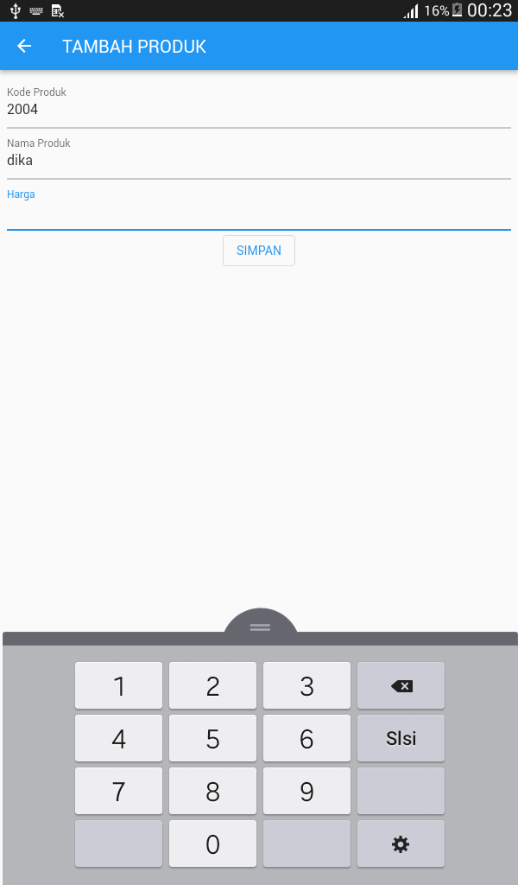

# tokokita

A new Flutter project.

## Getting Started

This project is a starting point for a Flutter application.

A few resources to get you started if this is your first Flutter project:

- [Lab: Write your first Flutter app](https://docs.flutter.dev/get-started/codelab)
- [Cookbook: Useful Flutter samples](https://docs.flutter.dev/cookbook)

For help getting started with Flutter development, view the
[online documentation](https://docs.flutter.dev/), which offers tutorials,
samples, guidance on mobile development, and a full API reference.

<h1>Hasil</h1>

<h2>Login Page </h2>
  
<h2>Register Page </h2>
  
<h2>List Produk Page </h2>
  
<h2>Detail Produk Page </h2>
  
<h2>Tambah Produk Page </h2>
  
<h2>Sidebar </h2>
  